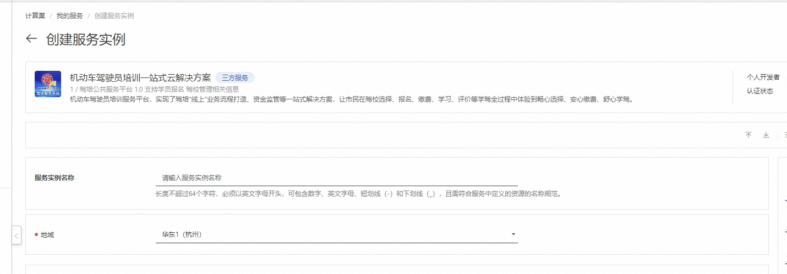
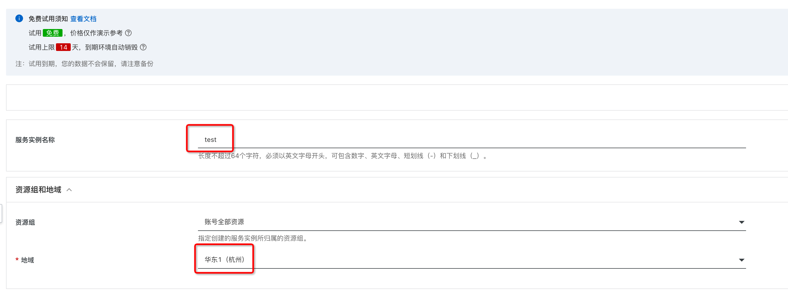
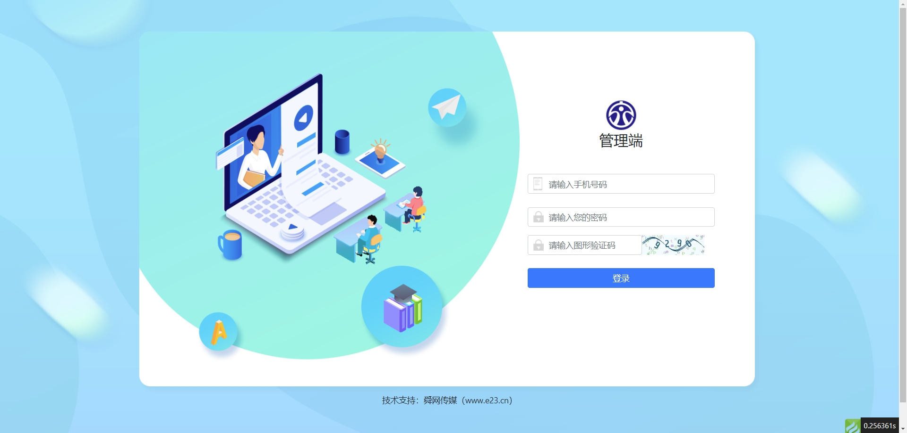

# 机动车驾驶员培训一站式云解决方案部署文档

## 概述
机动车驾驶员培训一站式云解决方案是山东舜网传媒股份有限公司研发的一款服务于驾培行业的专业软件，本平台通过搭建驾培公共服务一体化平台，打通驾校、计时商、理论商以及车管所等之间的数据壁垒，为学员提供便捷高效的全方位服务。提供驾校形象展示、行业监管及相关行业服务，以大数据、智能化助力提升驾培行业服务标准和形象，解决了驾考行业乱象丛生,收费不规范、授课秩序混乱等问题。通过本平台，实现了驾考流程数字化监管，方便市民根据自身需求自主择校，助力打造优质营商环境，促进驾培行业健康有序发展

## 部署流程

### 0. 准备工作

在正式开始使用前，您需要一个阿里云账号，对ECS、VPC等资源进行访问和创建操作。

- 若您使用个人账号，可以直接创建服务实例
- 若您使用RAM用户创建服务实例，且是第一次使用阿里云计算巢
    - 需要在创建服务实例前，对使用的RAM用户的账号添加相应资源的权限。添加RAM权限的详细操作，请参见[为RAM用户授
      权](https://help.aliyun.com/document_detail/121945.html)。
    
### 1. 部署入口

您可以在阿里云计算巢自行搜索，也可以通部署链接快速到达。

### 2. 申请试用

在正式试用前，需要申请试用，按照提示填写信息，在审核通过后就可以创建机动车驾驶员培训一站式云解决方案。

### 3. 创建机动车驾驶员培训一站式云解决方案

#### 3.1 参数列表

您在创建服务实例的过程中，需要配置服务实例信息的参数列表，具体如下。

| 参数组               | 参数项   | 示例          | 说明                                                           |
|--------------------|----------|---------------|--------------------------------------------------------------|
| 服务实例名称         | N/A      | test          | 实例的名称                                                     |
| 地域                 | N/A      | 华东1（杭州）   | 选中服务实例的地域，建议就近选中，以获取更好的网络延时。          |
| 付费类型配置         | 付费类型 | 按量付费      | 免费使用请选用按量付费                                         |
| 可用区配置           | 部署区域 | 可用区I       | 地域下的不同可用区域，确保实例非空                              |
| 选择已有基础资源配置 | VPC ID   | vpc-xxx       | 按实际情况，选择专有网络的ID。                                   |
| 选择已有基础资源配置 | 交换机ID | vsw-xxx       | 按实际情况，选择交换机ID。若找不到交换机, 可尝试切换地域和可用区 |
| ECS实例配置          | 实例类型 | ecs.r6.xlarge |                      |
| ECS实例配置 | 实例密码 | ******** | 设置实例密码。长度8~30个字符，必须包含三项（大写字母、小写字母、数字、 ()`~!@#$%^&*_-+={}[]:;'<>,.?/ 中的特殊符号）。 |

#### 3.2 具体步骤

创建服务按如下步骤进行，参考下图：

- 创建实例名称，如下图中“test”
- 选择地域，如下图中“华东1（杭州）”

- 选择实例类型
- 配置实例的密码
- 选择部署区域，如下图中“可用区I”

- 点击下一步，进入订单确认页面
- 勾选“权限确认”和“服务条款”中的复选框
- 点击左下角绿色背景的*开始免费试用*，即可创建服务实例

### 4. 启动机动车驾驶员培训一站式云解决方案服务

- 查看服务实例：服务实例创建成功后，部署时间大约需要2分钟。部署完成后，页面上可以看到对应的服务实例，如下图

- 点击web的链接，即可跳转访问已经部署好的管理后台
    - 通过登录页面上，输入demo手机号以及密码登录到驾校后台或者交通局管理端后台

## 常见问题FAQ

### 问题一：部署区域无可用资源

有时，所选部署区域（如可用区G）没有所选套餐的可用资源，会报错如下图所示

**解决办法**：尝试选择其他区域，如可用区I等

### 问题二: 启动后web访问不通

web的启动需要一点点时间，请稍后刷新页面即可。

### 问题三: 登录时的用户名密码不正确

请注意检查，登录时使用的密码请联系服务商电话 0531-67976194。

## 联系我们

- 舜网软件研究院：[https://cloud.e23.cn/](https://cloud.e23.cn)
- 联系电话 0531-67976194

